<!--
  BLULYK · GitHub Profile
  Dynamic visuals + locally generated GitHub analytics.
-->

  

  

  
  
  

---

## 👋 About Me

Hi, I'm **Blulyk** — a Computer Engineering student at **UEMC (Universidad Europea Miguel de Cervantes)**.

I use this GitHub profile as a **public engineering lab**: a place to build, test, break, improve and publish projects while learning how real systems work.

- 🎓 Computer Engineering student
- 🤖 AI-powered applications and autonomous systems
- ⚙️ Automation and practical software
- 🐳 Docker, NAS and self-hosted infrastructure
- 📱 Android, iOS and web development
- 🧪 Personal projects, experiments and prototypes
- 🎯 Always learning by building and shipping

---

## 🚀 Featured Projects

<table>
<tr>
<td width="50%" valign="top">

### 🌐 [dual-browser](https://github.com/Blulyk/dual-browser)

Dual-screen Chromium WebView browser for the **AYN Thor** and Android devices.

</td>
<td width="50%" valign="top">

### 🤖 [calorieai](https://github.com/Blulyk/calorieai)

An **AI-powered calorie tracking app**.

</td>
</tr>

<tr>
<td width="50%" valign="top">

### 📡 [mason-telegram-forwarder](https://github.com/Blulyk/mason-telegram-forwarder)

Umbrel app to forward **Telegram messages to n8n and WhatsApp**.

</td>
<td width="50%" valign="top">

### 🏠 [umbrel-app-store](https://github.com/Blulyk/umbrel-app-store)

My custom **Umbrel App Store** and self-hosting experiments.

</td>
</tr>
</table>

<b>More projects</b>

 

- 🍎 **[calorIOS](https://github.com/Blulyk/calorIOS)** — iOS / Swift project.
- 📍 **[FocusGeofence-Source](https://github.com/Blulyk/FocusGeofence-Source)** — AltStore and SideStore source for Focus Geofence.
- 🗂️ **[All repositories](https://github.com/Blulyk?tab=repositories)** — everything else I'm building.

---

## 💻 Tech Stack

### Languages

  

### Frameworks, backend & data

  

### Cloud, infrastructure & tooling

  

### Design & creative

  

### Homelab & automation

  
  
  
  
  
  

---

## 📊 GitHub Analytics

<!--
These cards are generated by .github/workflows/profile-assets.yml
and committed into this repository, so GitHub serves them directly.
-->

  
  

  
  

  

### Contribution activity

  

---

## 🐍 Contributions, but make them move

  <picture>
    <source media="(prefers-color-scheme: dark)" srcset="https://raw.githubusercontent.com/Blulyk/Blulyk/output/github-contribution-grid-snake-dark.svg">
    <source media="(prefers-color-scheme: light)" srcset="https://raw.githubusercontent.com/Blulyk/Blulyk/output/github-contribution-grid-snake.svg">
    
  </picture>

  

---

## 🏆 GitHub Trophies

<!-- Generated locally by profile-assets.yml -->

  

---

## 🔝 Projects & Contributions

  
  

---

### ✍️ Dev Quote

> **Build things that work. Understand how they work. Automate what should not be manual. Keep learning by shipping.**

---

## 🤝 Connect

  
  

---

## ☕ Support my projects

  

  Building, learning and shipping — one repository at a time.

  

